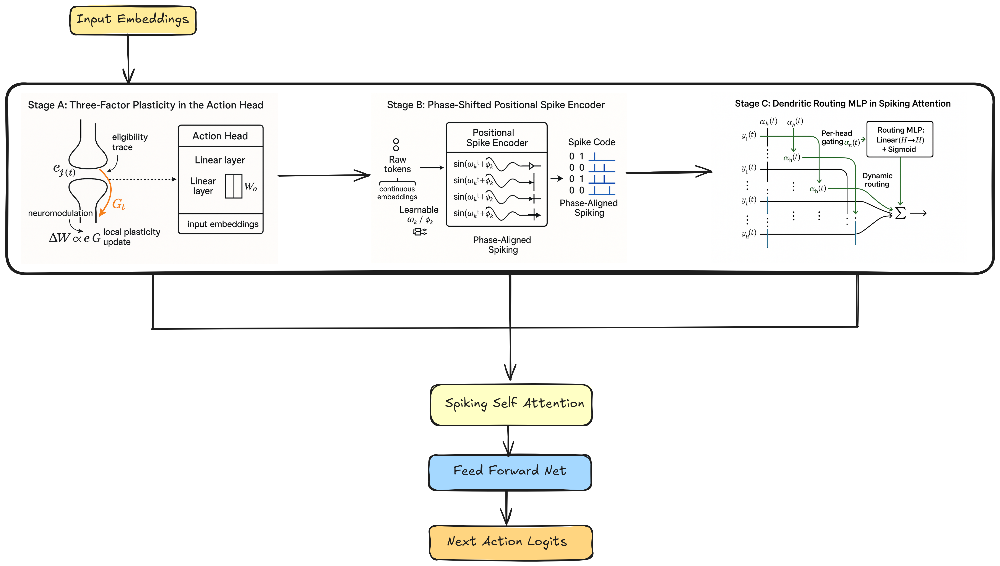

<div align="center">

# Neuromorphic Decision Transformer (SNN-DT)

[](https://opensource.org/licenses/MIT)
[](https://www.python.org/downloads/)
[](https://pytorch.org/)
[](https://arxiv.org/abs/2508.21505)


**Local Plasticity, Phase-Coding, and Dendritic Routing for Low-Power Sequence Control**

[](https://neuromorphic-decision-transformer.vercel.app/)

</div>

## Abstract

This repository contains the official PyTorch implementation of the **Spiking Decision Transformer (SNN-DT)**, as presented in the paper *"Spiking Decision Transformers: Local Plasticity, Phase-Coding, and Dendritic Routing for Low-Power Sequence Control"* (Pandey & Biswas, 2025).

The SNN-DT architecture bridges the gap between the sequential modeling capabilities of Transformers and the energy efficiency of Spiking Neural Networks (SNNs). By embedding **Leaky Integrate-and-Fire (LIF)** neurons within the self-attention mechanism and utilizing accurate **STDP-inspired local plasticity**, this model achieves state-of-the-art performance on continuous control tasks while reducing energy consumption by orders of magnitude compared to traditional ANN-based Decision Transformers.

<div align="center">
  
</div>
*(Note: Visualizations available in the `visualizations/` directory)*

## Key Features

-   **Neuromorphic Efficiency**: Replaces standard activation functions with temporal spike-based logic, significantly reducing computational overhead suitable for edge deployment.
-   **Phase-Coded Positional Encoding**: A biologically plausible method for encoding sequence order using spike timing phases.
-   **Dendritic Routing**: Efficient information routing mechanism mimicking biological dendritic trees.
-   **Three-Factor Local Plasticity**: Implements STDP-like learning rules for robust weight updates without heavy backpropagation costs during inference-time adaptation.
-   **Standard Gym Benchmarks**: Evaluated on classic control tasks: `CartPole-v1`, `Pendulum-v1`, `MountainCar-v0`, and `Acrobot-v1`.

## Installation

System requirements: Linux/Windows, Python 3.8+, CUDA-enabled GPU (recommended).

```bash
# Clone the repository
git clone https://github.com/Vishal-sys-code/neuromorphic_decision_transformer.git
cd neuromorphic_decision_transformer

# Create a virtual environment (optional but recommended)
python -m venv venv
source venv/bin/activate  # On Windows: venv\Scripts\activate

# Install dependencies
pip install -r requirements.txt
```

## Usage

### Training
To train the SNN-DT model on a specific environment (e.g., `Pendulum-v1`), use the provided training script. The training pipeline handles data generation, preprocessing, and model optimization.

```bash
# Run training for Pendulum-v1
python snn-dt/scripts/train.py --model snn_dt --env "Pendulum-v1" --save-dir "results/snn_dt_pendulum"
```

To run the full suite of experiments across all environments:
```bash
./run_all_experiments.sh
```

### Evaluation
Evaluate a pre-trained checkpoint to measure return, spike counts, latency, and estimated energy consumption.

```bash
python eval_snn_dt.py \
    --env "Pendulum-v1" \
    --checkpoint_path "results/snn_dt_pendulum/best_model.pt" \
    --target_return -200 \
    --episodes 50
```

**Key Arguments:**
-   `--context_len`: Context length ($K$) for the transformer (default: 20).
-   `--per_spike_energy`: Estimated energy per spike in Joules (default: 4.6pJ for 45nm process).

## Project Structure

```
neuromorphic_decision_transformer/
├── configs/            # YAML configuration files for experiments
├── snn-dt/             # Core SNN-DT source code
│   ├── src/            # Model definitions and extensive util libraries
│   └── scripts/        # Training and utility scripts
├── demos/              # Demonstration notebooks and videos
├── eval_snn_dt.py      # Standalone evaluation script
├── requirements.txt    # Python dependencies
└── run_all_experiments.sh # Batch experiment runner
```

## Citation

If you use this code or find our work helpful, please cite our paper:

```bibtex
@article{pandey2025spiking,
  title={Spiking Decision Transformers: Local Plasticity, Phase-Coding, and Dendritic Routing for Low-Power Sequence Control},
  author={Pandey, Vishal and Biswas, Debasmita},
  journal={arXiv preprint arXiv:2508.21505},
  year={2025}
}
```

## License

This project is licensed under the MIT License - see the [LICENSE](LICENSE) file for details.
