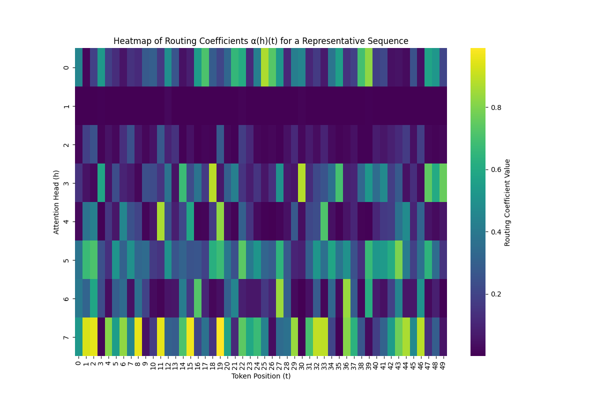

<div align="center">

# 🧠 Neuromorphic Decision Transformer (SNN-DT)

[](https://opensource.org/licenses/MIT)
[](https://www.python.org/downloads/)
[](https://pytorch.org/)
[](https://arxiv.org/abs/2508.21505)
[](https://vishal-sys-code.github.io/neuromorphic_decision_transformer/)

**Local Plasticity, Phase-Coding, and Dendritic Routing for Low-Power Sequence Control**
</div>

---

## 🌟 Overview

This repository contains the official PyTorch implementation of the **Spiking Decision Transformer (SNN-DT)**, as presented in our flagship research paper:
> *"Spiking Decision Transformers: Local Plasticity, Phase-Coding, and Dendritic Routing for Low-Power Sequence Control"* (Pandey & Biswas, 2025).

The SNN-DT architecture bridges the gap between the sequential modeling capabilities of dense Transformers and the extreme energy efficiency of Spiking Neural Networks (SNNs). By embedding **Leaky Integrate-and-Fire (LIF)** neurons within the block components, we secure state-of-the-art performance on continuous control tasks while reducing energy consumption by over four orders of magnitude ($\approx 40$ nJ).

<div align="center">
  
</div>

---

## ✨ Core Neuromorphic Innovations

- 🕒 **Phase-Coded Positional Encoding:** Replaces generic float embeddings with rhythmic, spike phase-shifted encodings.
- 🌳 **Dendritic-Style Routing MLP:** Context-dependent gating coefficients dynamically prune attention heads without uniform averaging.
- 🧬 **Three-Factor Local Plasticity:** Elegantly implements STDP-like localized credit assignment rules, circumventing catastrophic unrolling.

<div align="center">
  
  <p><em>Dynamic Dendritic Gating Coefficients</em></p>
</div>

---

## 🚀 Quickstart & Installation

**System Requirements:** Linux/Windows, Python 3.8+, CUDA-enabled GPU (Recommended).

```bash
# Clone the repository
git clone https://github.com/Vishal-sys-code/neuromorphic_decision_transformer.git
cd neuromorphic_decision_transformer

# Install core dependencies natively
pip install -r requirements.txt
```

> [!TIP]
> For deploying the documentation locally via Sphinx, execute `make html` inside the `/docs` directory!

---

## 💻 Experimental Workflows

### 1. Training the Architecture
Run the SNN-DT training pipeline, handling automated data orchestration and surrogate gradient optimization.

```bash
python snn-dt/scripts/train.py --model snn_dt --env "Pendulum-v1" --save-dir "results/snn_dt_pendulum"
```
Or execute the entire benchmarking suite across **CartPole-v1**, **MountainCar-v0**, and **Acrobot-v1**:
```bash
./run_all_experiments.sh
```

### 2. Neuromorphic Evaluation & Profiling
Evaluate checkpoint inference trajectories and monitor strict event-driven metrics (absolute spike outputs).
```bash
python eval_snn_dt.py \
    --env "Pendulum-v1" \
    --checkpoint_path "results/snn_dt_pendulum/best_model.pt" \
    --target_return -200
```
> [!NOTE]
> The runtime reports normalized return against the expert policy baseline alongside the average hardware energy proxies (Spikes / timestep).

---

## 📖 Citation

If you build upon this architecture or framework, please consider citing our underlying research:

```bibtex
@article{pandey2025spiking,
  title={Spiking Decision Transformers: Local Plasticity, Phase-Coding, and Dendritic Routing for Low-Power Sequence Control},
  author={Pandey, Vishal and Biswas, Debasmita},
  journal={arXiv preprint arXiv:2508.21505},
  year={2025}
}
```

<div align="center">
  <i>Maintained with ❤️ by the SNN-DT Research Team. Licensed under <a href="LICENSE">MIT</a>.</i>
</div>
