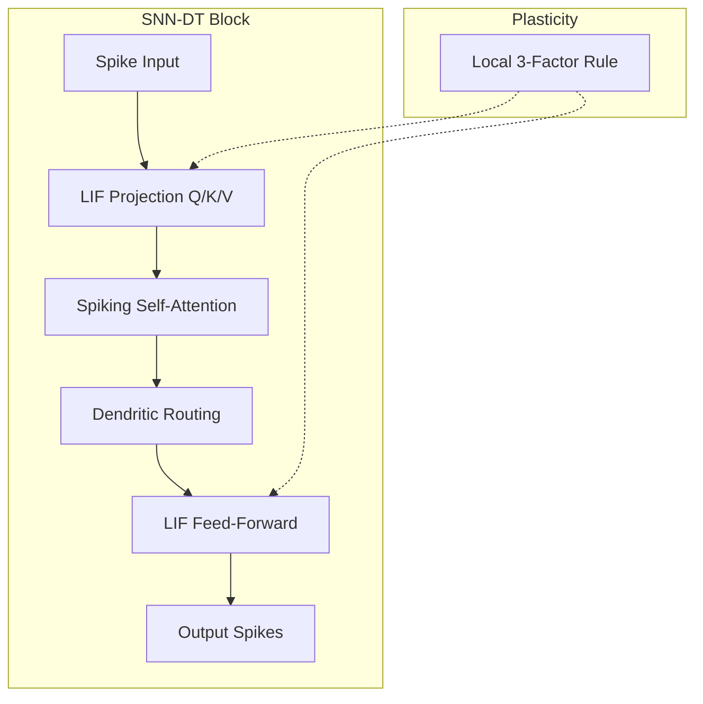

# Architecture & Theory

The **Spiking Decision Transformer (SNN-DT)** represents a paradigm shift from dense, matrix-multiplication-heavy Transformers to sparse, event-driven Spiking Neural Networks.

## System Overview

Traditional Decision Transformers (DTs) model trajectories $\tau$ using causal masking and dense attention. SNN-DT preserves this sequence modeling capability but executes it in the spiking domain.

## Spiking Self-Attention (SSA)

We replace the dot-product attention with a spike-based operation.

1.  **LIF Projections**: Input spikes are projected via learnable weights into Query ($Q$), Key ($K$), and Value ($V$) spike trains.
2.  **Attention formulation**:
    Instead of $softmax(\frac{QK^T}{\sqrt{d}})$, we use an accumulation of coincidence detections regulated by the firing thresholds of the postsynaptic neurons.

### LIF Neuron Dynamics

The membrane potential $u_t$ evolves according to:

$$ u_t = \beta u_{t-1} + (1-\beta) W x_t - S_{t-1} V_{th} $$

where:
*   $u_t$: Membrane potential at time $t$.
*   $\beta$: Decay factor ($e^{-dt/\tau}$).
*   $S_t$: Discrete spike output ($S_t \in \{0, 1\}$).

## Dendritic Routing and Sparsity

To minimize energy, SNN-DT employs specific mechanisms to induce sparsity:

*   **Phase-Coding**: Encodes values in the timing of spikes, reducing the total number of spikes needed to represent continuous values.
*   **Dendritic Routing**: A gating mechanism that dynamically prevents activity propagation to irrelevant heads or tokens, effectively "pruning" the computation graph on-the-fly.

## Learning with Plasticity

We use a surrogate gradient method for end-to-end training, augmented by local plasticity:

$$ \nabla W_{total} = \nabla W_{BPTT} + \lambda \cdot \Delta W_{STDP} $$

This hybrid approach stabilizes training and improves generalization to unseen tasks (e.g., changes in gravity or friction in Gym environments).